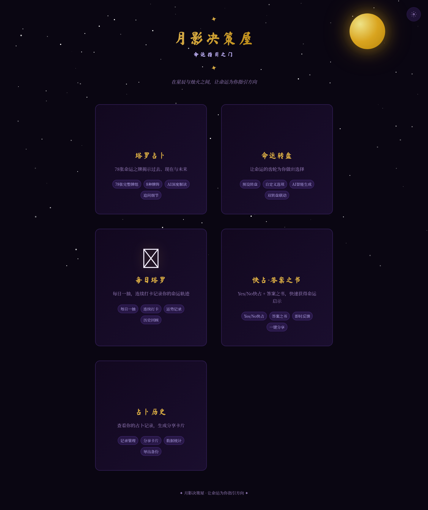
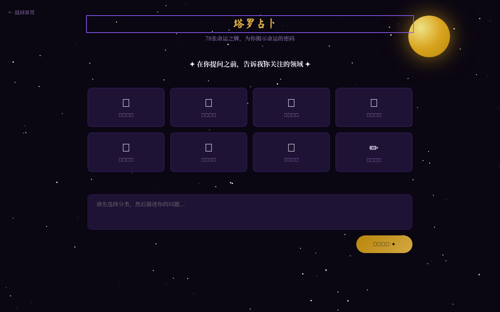
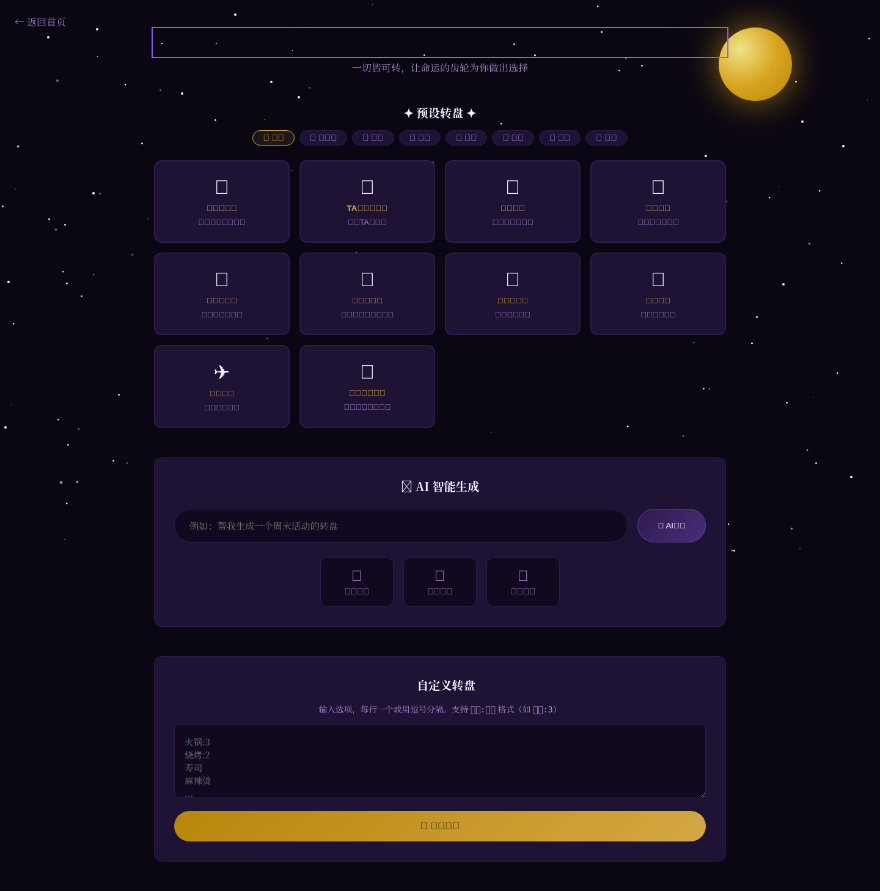
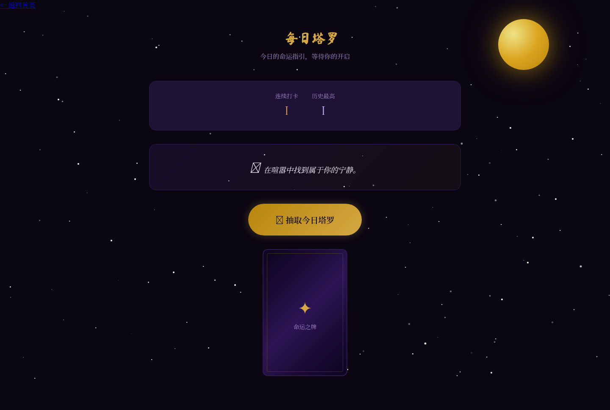
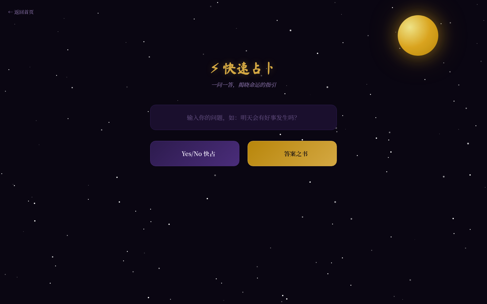
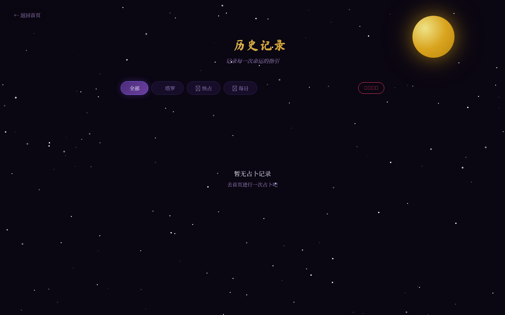
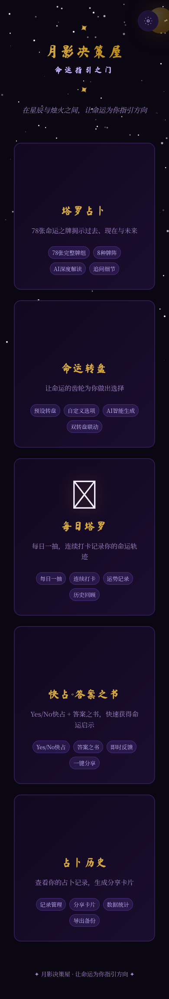

<div align="center">


# 🔮 月影决策屋 · Moon Oracle

**AI 驱动的塔罗占卜 & 命运转盘 · 零依赖 · 零构建 · 零服务器**

<sub><i>在星辰与烛火之间，让命运为你指引方向</i></sub>

<br>

<a href="https://gary23333.github.io/moon-oracle/"></a>
<a href="#-快速开始"></a>
<a href="https://github.com/Gary23333/moon-oracle/blob/main/CHANGELOG.md"></a>
<a href="LICENSE"></a>

<br><br>


</div>

---

## 🖼 页面预览

> 实际页面截图（桌面 1440×900 · 移动 390×844），从左至右依次为首页、塔罗占卜、命运转盘、每日塔罗、快占·答案之书、占卜历史。

| | | |
|:---:|:---:|:---:|
|  |  |  |
| **🏠 命运指引之门** 五入口矩阵 | **🔮 塔罗占卜** 78 张牌 · 8 种牌阵 | **🎡 命运转盘** 10 预设 · AI 生成 |
|  |  |  |
| **✨ 每日塔罗** 连续打卡 · 40 语录 | **📖 快占·答案之书** Yes/No + 193 答案 | **📜 占卜历史** 50 条 · 分享卡片 |

<details>
<summary>📱 移动端预览（点击展开）</summary>

| | |
|:---:|:---:|
|  | |
| **🏠 首页 · iPhone 14 视口** | 完美适配移动端 · 768px 断点 |

</details>

---

## ✨ 核心特色

<table>
<tr>
<td width="50%" valign="top">

### 🔮 塔罗占卜
完整 **78 张 Rider-Waite-Smith** 塔罗牌（22 大阿卡纳 + 56 小阿卡纳），**8 种牌阵**（1~10 张牌全覆盖），**8 大问题分类**自动推荐牌阵，**DeepSeek 思考模式**深度推理，3D 翻牌动画 + 金色光效，解读前追问细节、解读后多轮追问。

</td>
<td width="50%" valign="top">

### 🎡 命运转盘
**10 个预设转盘**（美食·感情·决策·娱乐·生活·健康·学习），**AI 一句话生成**（自然语言 → JSON），**OCR 截图识别**（Tesseract.js 浏览器端），**附近美食双转盘**（定位→菜系→餐厅），**电影推荐**，**加权渲染**（`选项:权重` 格式）。

</td>
</tr>
<tr>
<td width="50%" valign="top">

### ✨ 每日塔罗
日期种子算法（每日一牌不变），**Streak 连续打卡**统计，**40 条神秘主题日签**，可选 AI 深度解读。

</td>
<td width="50%" valign="top">

### 📖 快占·答案之书
**Yes/No 二元快占**（牌义加权算法），**193 条神秘学答案之书**，即时反馈，零 API 也能用。

</td>
</tr>
<tr>
<td width="50%" valign="top">

### 📜 占卜历史 & 分享
**50 条 localStorage 持久化**，类型筛选、详情查看、删除管理；**Canvas 生成 PNG 分享卡**，精美神秘主题。

</td>
<td width="50%" valign="top">

### 👤 AI 解牌人格
**🔮 严肃智者**（正统神秘学）· **💫 温柔疗愈**（温暖关怀）· **🔥 毒舌好友**（幽默犀利），一秒钟切换解牌风格。

</td>
</tr>
</table>

---

## 🚀 快速开始

```bash
# 1. 克隆仓库
git clone https://github.com/Gary23333/moon-oracle.git
cd moon-oracle

# 2. 安装依赖
npm install

# 3. 启动开发服务器
npm run dev
# 默认运行在 http://localhost:5173/
```

<details>
<summary><b>🛠 配置 DeepSeek API Key（点击展开）</b></summary>

1. 访问 [platform.deepseek.com](https://platform.deepseek.com/) 获取 API Key
2. 打开任意页面 → 右上角 ⚙️ 齿轮图标
3. 填入 API Key → 保存
4. 立即生效（存储于浏览器 `localStorage`）

> 💡 **没有 API Key？** 预设转盘、自定义转盘、OCR 识别、每日塔罗、答案之书均可**独立使用**，不影响核心体验。

</details>

<details>
<summary><b>📦 生产构建（点击展开）</b></summary>

```bash
npm run build     # 输出到 dist/
npm run preview   # 本地预览构建产物
```

构建产物为纯静态文件，可部署到 GitHub Pages、Vercel、Netlify、对象存储等任意静态服务。

</details>

---

## 📚 详细功能

### 🔮 塔罗占卜

- **78 张完整牌组** — 22 大阿卡纳 + 56 小阿卡纳，含完整正逆位牌义
- **8 种牌阵** — 单牌 → 凯尔特十字，1~10 张牌全覆盖
- **8 大问题分类** — 情感 · 事业 · 财运 · 学业 · 健康 · 抉择 · 日常 · 自定义
- **智能牌阵推荐** — 根据问题类型自动匹配最佳牌阵
- **DeepSeek 思考模式** — 深度推理驱动的结构化解读（可显示推理链）
- **3D 翻牌动画** — Y 轴 180° 旋转 + 金色光效
- **细节追问** — 解读前收集补充信息，解读后多轮追问
- **自定义提示词** — 完全可调的系统提示词模板

### 🎡 命运转盘

- **10 个预设转盘** — 涵盖美食 · 感情 · 决策 · 娱乐 · 生活 · 健康 · 学习
- **AI 一句话生成** — 输入自然语言，自动解析为转盘选项
- **📷 OCR 截图识别** — Tesseract.js 浏览器端 OCR，图片文字自动提取为转盘选项
- **📍 附近美食双转盘** — Geolocation 定位 → AI 菜系推荐 → AI 餐厅推荐
- **🎬 电影推荐** — AI 生成热门/经典电影选择转盘
- **✨ AI 结果解读** — 转盘出结果后 AI 趣味解读命运的选择
- **⚖️ 自定义权重** — 支持 `选项:权重` 格式，控制每个选项的扇区大小
- **Canvas 加权渲染** — 物理旋转引擎 + cubic easing 缓动动画

### ✨ 每日塔罗

- **日期种子算法** — 每天一牌不变
- **Streak 连续天数统计** — 记录连续打卡天数
- **40 条每日语录** — 精选神秘主题日签文案
- **可选 AI 解读** — 纯前端日期种子，AI 解读为可选项

### 📖 快占·答案之书

- **Yes/No 二元快占** — 牌义加权算法结合正逆位概率
- **193 条答案之书** — 丰富的神秘学风格回复
- **即时反馈** — 无需等待，零 API 也能用
- **可选 AI 增强** — 启用 API 后可获得更深的解读

### 📜 占卜历史

- **50 条上限存储** — localStorage 持久化
- **类型筛选** — 支持按类型过滤记录
- **详情查看与删除** — 完整历史管理
- **Canvas 分享卡** — 一键生成分享 PNG

### 👤 AI 解牌人格

| 人格 | 风格 | 适合场景 |
|:---|:---|:---|
| 🔮 **严肃智者** | 严谨、专业、深度分析 | 重要决策 · 正式场合 |
| 💫 **温柔疗愈**（默认） | 温暖、鼓励、安抚 | 情绪低落 · 需要鼓励 |
| 🔥 **毒舌好友** | 幽默、直白、一针见血 | 想要真相 · 不怕扎心 |

### 🔧 共享能力

| 能力 | 说明 |
|:---|:---|
| DeepSeek API | OpenAI 兼容格式 · 思考模式 · 120 秒超时 · AbortController 取消 |
| 配置系统 | localStorage 持久化 · deepMerge 递归合并 · 可自定义全部提示词模板 |
| 视觉系统 | 150 颗闪烁星星 · 月亮光晕 · 粒子爆发 · 屏幕闪光 |
| 无障碍 | ARIA 属性 · 键盘导航 · 焦点管理 · `prefers-reduced-motion` |
| 响应式 | 完美适配移动端 · 768px 断点 |

---

## 🛠 技术栈

| 类别 | 选型 | 用途 |
|:---|:---|:---|
| 构建工具 | **Vite 8** | 多页应用 · ES Module · 零配置开发 |
| 前端三件套 | HTML5 + CSS3 + Vanilla JS | 零框架依赖 |
| 渲染 | **Canvas 2D** | 塔罗 3D 翻转 · 转盘加权渲染 · 分享卡片 |
| AI | **DeepSeek API** | 塔罗解读 · 转盘生成 · 趣味解读 |
| OCR | **Tesseract.js 7** | 浏览器端截图文字识别 |
| 字体 | Google Fonts (Cinzel + Noto Serif SC + Ma Shan Zheng) | 神秘主题排版 |
| 存储 | `localStorage` | 配置 · 历史 · 连续打卡 |
| 定位 | Geolocation API | 附近美食推荐 |
| 网络 | HTTPS + AbortController + 120s 超时 | API 安全调用 |

---

## 📁 项目结构

```
moon-oracle/
├── index.html                         # 🏠 首页 — 五入口矩阵
├── tarot.html                         # 🔮 塔罗占卜
├── wheel.html                         # 🎡 命运转盘
├── daily.html                         # ✨ 每日塔罗
├── quick.html                         # 📖 快占·答案之书
├── history.html                       # 📜 占卜历史
├── screenshots/                       # 🖼 README 页面截图
├── scripts/
│   └── screenshot.mjs                 # Puppeteer 截图脚本
├── css/
│   ├── base.css                       # 基础样式 · 星空 · 配置面板
│   ├── tarot.css                      # 塔罗样式 · 选牌 · 3D 翻转
│   └── wheel.css                      # 转盘样式 · Canvas · 结果展示
├── js/
│   ├── common/                        # 🔧 共享模块
│   │   ├── config.js                  #   配置管理 (deepMerge)
│   │   ├── api.js                     #   DeepSeek API 封装
│   │   ├── utils.js                   #   工具函数 (Toast/XSS/打字机)
│   │   ├── effects.js                 #   视觉效果 (星空/粒子/闪光)
│   │   └── prompts.js                 #   共享提示词模板
│   ├── tarot/                         # 🔮 塔罗模块
│   │   ├── app.js                     #   主控制器 (5 视图流转)
│   │   ├── cards-data.js              #   78 张牌完整数据
│   │   ├── spreads.js                 #   8 种牌阵定义
│   │   ├── classifier.js              #   问题分类器
│   │   └── prompts.js                 #   提示词模板
│   ├── wheel/                         # 🎡 转盘模块
│   │   ├── app.js                     #   主控制器 (预设/自定义/AI/双转盘)
│   │   ├── presets.js                 #   10 个预设转盘
│   │   ├── ai-generator.js            #   AI 生成器 (OCR/位置/电影/解读)
│   │   └── wheel-renderer.js          #   Canvas 渲染引擎
│   ├── daily/                         # ✨ 每日塔罗模块
│   │   ├── app.js                     #   主控制器
│   │   └── quotes.js                  #   40 条每日语录
│   ├── quick/                         # 📖 快占模块
│   │   ├── app.js                     #   主控制器
│   │   ├── answers.js                 #   193 条答案之书
│   │   └── oracle.js                  #   牌义加权算法
│   └── history/                       # 📜 历史模块
│       ├── app.js                     #   主控制器
│       └── store.js                   #   localStorage 存储管理
├── api-docs/
│   └── README.md                      # 📖 API 接口文档
├── vite.config.js                     # Vite 配置
├── package.json
├── CHANGELOG.md
├── CONTRIBUTING.md
├── LICENSE
└── README.md
```

---

## 📊 速查表

### ⚙️ 配置项

| 字段 | 默认值 | 说明 |
|:---|:---|:---|
| `apiUrl` | `https://api.deepseek.com` | DeepSeek API 端点 |
| `apiKey` | _(空)_ | DeepSeek API 密钥 |
| `model` | `deepseek-v4-flash` | AI 模型名称 |
| `thinkingEnabled` | `true` | 是否启用深度思考模式 |
| `thinkingEffort` | `high` | 思考强度（`high` 标准 / `max` 最强） |
| `showThinking` | `false` | 是否在 UI 中显示 AI 推理链 |
| `typingSpeed` | `30` | 打字机效果速度（ms/字） |
| `wheelResultAI` | `false` | 转盘结果是否自动调用 AI 解读 |
| `readerPersona` | `gentle` | 解牌人格（`serious` / `gentle` / `blunt`） |
| `tarotPrompts` | 预设模板 | 塔罗系统提示词（可自定义） |
| `wheelPrompts` | 预设模板 | 转盘系统提示词（可自定义） |

### 🎴 牌阵一览

| 牌阵 | 牌数 | 适用场景 | 位置含义 |
|:---|:---:|:---|:---|
| 单牌占卜 🔮 | 1 | 简单问题 · 每日指引 | 核心答案 |
| 三牌占卜 🌙✨☀️ | 3 | 时间脉络 · 发展走向 | 过去 · 现在 · 未来 |
| 爱情十字 💕 | 5 | 感情问题 | 你的感受 · 对方感受 · 关系现状 · 障碍 · 结果 |
| 事业金字塔 💼 | 5 | 事业发展 | 现状基础 · 面临挑战 · 你的优势 · 环境影响 · 最终结果 |
| 二选一 ⚖️ | 5 | 决策 · 两难抉择 | 当前状况 · 选项A · 选项B · 阻碍因素 · 最终建议 |
| 凯尔特十字 ✦ | 10 | 重大问题 · 最全面 | 10 个维度全方位解析 |
| 四季牌阵 🌸🌻🍂❄️ | 4 | 年度运势 | 春 · 夏 · 秋 · 冬 |
| 生命之树 🌳 | 10 | 人生深层意义 | 卡巴拉 10 个质点 |

### 🎡 预设转盘

| 转盘 | 图标 | 分类 | 选项数 |
|:---|:---:|:---:|:---:|
| 中午吃什么 | 🍜 | 美食 | 12 |
| TA 喜不喜欢我 | 💕 | 感情 | 8 |
| 是还是否 | ✅ | 决策 | 6 |
| 看啥电影 | 🎬 | 娱乐 | 8 |
| 喝什么奶茶 | 🧋 | 美食 | 8 |
| 今天运动啥 | 🏃 | 健康 | 8 |
| 周末去哪玩 | 🎉 | 生活 | 8 |
| 先学什么 | 📚 | 学习 | 8 |
| 去哪旅行 | ✈️ | 生活 | 8 |
| 今天心情如何 | 🌈 | 生活 | 8 |

### 🤖 LLM 调用策略

| 场景 | 调用次数 | 思考模式 | 说明 |
|:---|:---:|:---:|:---|
| 塔罗完整占卜 | 1 次 | ✅ | 含完整牌义上下文 |
| 塔罗追问 | 每次 1 次 | ✅ | 保持占卜上下文 |
| 每日塔罗 | 0~1 次 | ✅ | 纯前端日期种子，可选 AI 解读 |
| 快占·答案之书 | 0~1 次 | ❌ | 纯前端牌义加权，可选 AI 增强 |
| 转盘 AI 生成 | 1 次 | ❌ | 自然语言 → JSON |
| OCR 识别 | 0 次 | — | Tesseract.js 浏览器端 |
| 附近美食 | 2 次 | ❌ | 菜系推荐 + 餐厅推荐 |
| 电影推荐 | 1 次 | ❌ | AI 生成电影列表 |
| 结果 AI 解读 | 1 次 | ❌ | 可选，需开启配置 |
| 预设/自定义转盘 | 0 次 | — | 纯前端 |

---

## 🔒 安全说明

- **API Key 安全** — 仅存储在浏览器 `localStorage`，不会发送到第三方服务器
- **HTTPS 加密** — 所有 API 请求通过 HTTPS 加密传输
- **XSS 防护** — 用户输入先 HTML 转义再应用 Markdown 渲染
- **请求控制** — 120 秒超时 + `AbortController` 主动取消
- **代码安全** — 内联事件处理器已全部替换为 `addEventListener`
- **依赖最小化** — 仅 1 个运行时依赖（Tesseract.js），攻击面小

---

## 🤝 贡献

欢迎贡献！请阅读 [CONTRIBUTING.md](CONTRIBUTING.md)。

- [🐛 报告 Bug](https://github.com/Gary23333/moon-oracle/issues/new?template=bug_report.md)
- [💡 功能建议](https://github.com/Gary23333/moon-oracle/issues/new?template=feature_request.md)
- [🔀 提交 PR](https://github.com/Gary23333/moon-oracle/pulls)

---

## 📝 版本历史

| 版本 | 日期 | 亮点 |
|:---|:---|:---|
| **v3.0.0** | 2026-07-27 | 🆕 每日塔罗 · 快占·答案之书 · 占卜历史 · 分享卡片 · AI 解牌人格 · Vite 多页应用重构 |
| **v2.1.0** | 2026-06-01 | 🆕 OCR 截图识别 · 附近美食双转盘 · 电影推荐 · AI 结果解读 · 自定义权重 |
| **v2.0.0** | 2026-06-01 | 🐛 修复 · 无障碍 · 性能优化 · SEO |
| **v1.0.0** | 2026-05-27 | 🎉 初始发布 · 塔罗占卜 · 命运转盘 · DeepSeek 集成 |

详见 [CHANGELOG.md](CHANGELOG.md)。

---

## 📄 License

[MIT License](LICENSE) © 2026 Moon Oracle

塔罗牌图像来自 [Wikimedia Commons](https://commons.wikimedia.org/)，属于**公共领域**。

---

<div align="center">

**✦ 月影决策屋 · 让命运为你指引方向 ✦**

<sub>Built with 🔮 and ✨</sub>

<br><br>

<sub>如果这个项目对你有帮助，请给一个 ⭐ Star！</sub>

<br>

<sub><a href="#-月影决策屋--moon-oracle">⬆ 回到顶部</a></sub>

</div>
